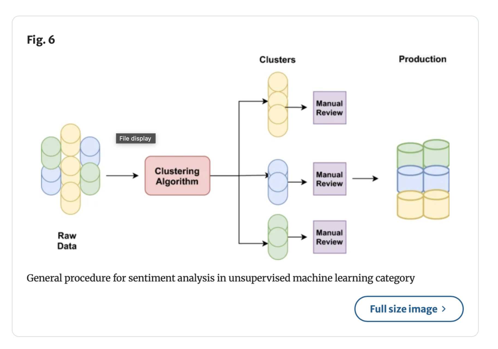

# LoveLetterAnalysis

The "Love Letter Analysis" project is an exploratory data analysis and natural language processing (NLP) project focused on sentiment analysis, clustering, and topic modeling of a collection of love letters. It utilizes various Python libraries to preprocess, analyze, and visualize the dataset, aiming to uncover common themes, sentiments, and expressions within the letters.

## Key Components
- **Data Cleaning and Preprocessing**: Techniques to clean and prepare the text data for analysis.
- **Visualization**: Use of matplotlib, seaborn, and WordCloud libraries to create visualizations.
- **Sentiment Analysis**: Application of NLTK's VADER for sentiment analysis of the letters.
- **Clustering and Topic Modeling**: Implementation of K-Means clustering and LDA for uncovering themes. Clustering was done in accordance with this paper - https://link.springer.com/article/10.1007/s10462-022-10144-1

## Libraries Used
- Pandas
- NLTK
- matplotlib
- seaborn
- WordCloud
- Scikit-learn

## Repository Contents
- `LoveLetterAnalysis.ipynb`: The primary Jupyter notebook that outlines the data analysis process, including data cleaning, visualization, sentiment analysis, and clustering.
- `app.py`: Flask application script to run a web app that displays cleaned love letters.
- `static/`: Contains static assets used by the web application.
- `templates/`: Contains HTML templates for rendering the web application.

## Contributing

If you'd like to contribute to the LoveLetterAnalysis project, please fork the repository and issue a pull request with your proposed changes.
